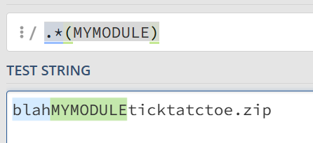

# zefc - zip etalon file checker

Simply check files in ZIP archive against etalon file with SHA1 hashes.

If you specify `--gui` option, simple GUI will be shown with results.

## how is it working?
> _Fast._ Uses concurrent processing with worker pools based on available CPU cores.

```
zefc blahMYMODULEticktatctoe.zip --gui
```


## return codes
* 0 - etalon created OR ZIP file is OK
* 1 - wrong number of arguments
* 2 - the provided ZIP file does not exist
* 3 - the provided ZIP file is not a handled (check patterns)
* 4 - ZIP file content is NOT ok

## details
1. from `zip` file is extracted `etalon name` - by regex's group 1 (first brackets) from file name.
2. etalon `%USERPROFILE%\zefc\{etalon}.eta` file is created for first time
3. next time `zip` file content is checked against `%USERPROFILE%\zefc\{etalon}.eta` 

There can be multiple `a` and `r` lines for each profile.




## patterns sample
```yaml
# p: pattern for etalon name
# a: accept line(s) - at least one positive
# r: reject line(s) - if one is matched, file is not hashed

profiles:
# build etalon ETALON.eta
# blahMYETALONticktatctoe.zip -> ETALON
- p: blahMY(ETALON).*
  a:
    - System.Windows.Xml.dll
  r:
    - Readme\.md
    - \.(cs|less)
```

# changes
17.12.2025 - move to SHA256 - even SHA1 is ok, in some cases is better to be safe

Pavel Prchal, 2025
